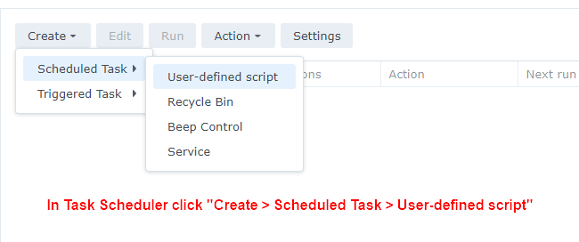
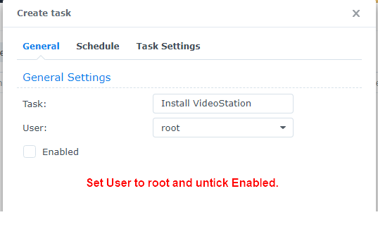
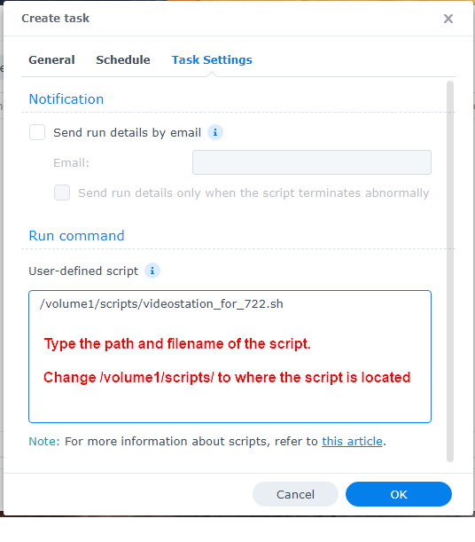
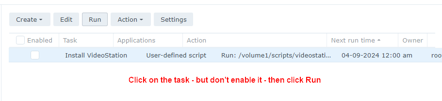

# How to run a script in Synology Task Scheduler

To run a script from Task Scheduler follow these steps:

**Note:** You can setup a schedule task and leave it disabled, so it only runs when you select the task in the Task Scheduler and click on the Run button.

1. Go to **Control Panel** > **Task Scheduler** > click **Create** > and select **Scheduled Task**.
2. Select **User-defined script**.
3. Enter a task name.
4. Select **root** as the user (The script needs to run as root).
5. Untick **Enable** so it does **not** run on a schedule.
6. Click **Task Settings**.
7. In the box under **User-defined script** type the path to the script. 
    - e.g. If you saved the script to a shared folder on volume 1 called "scripts" you'd type: **/volume1/scripts/videostation_for_722.sh**
8. Click **OK** to save the settings.
9. Click on the task - but **don't** enable it - then click **Run**.
10. Once the script has run you can delete the task, or keep in case you need it again.

**Here's some screenshots showing what needs to be set:**

Step 1

Step 2

Step 3

Step 4

