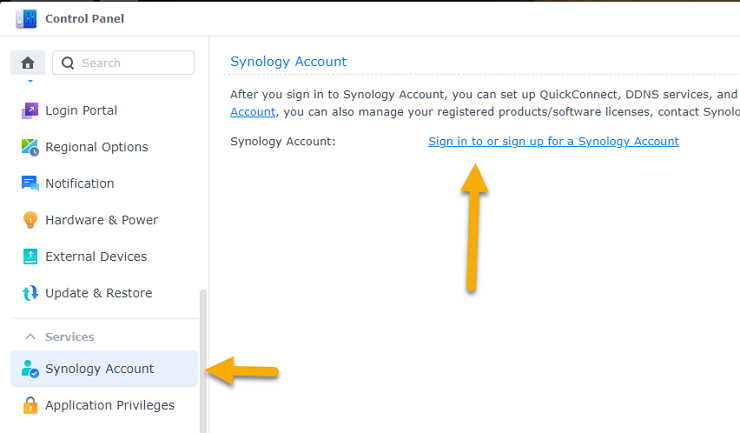
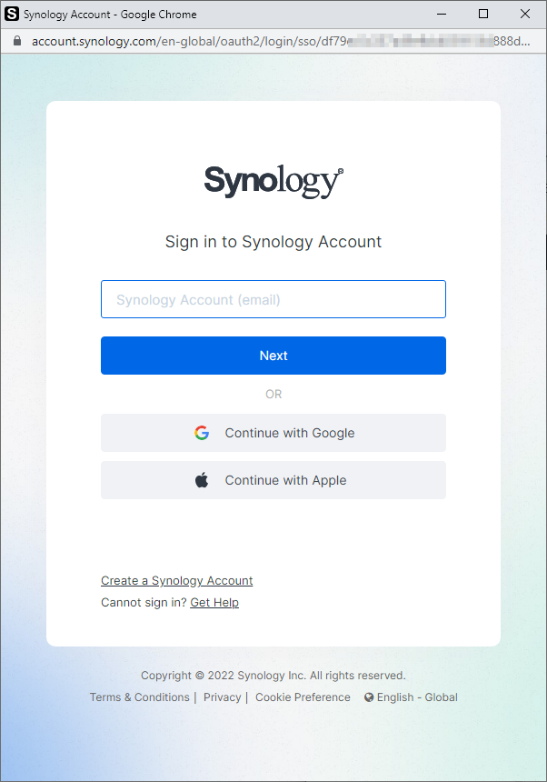

# How to sign into your Synology account

Enabling the HEVC codec in Advanced Media Extensions requires you are signed in to a Synology Account.

1. **Control Panel** > **Synology Account**
2. When you first open Advanced Media Extensions you may need to sign in to your Synology Account.

### Troubleshooting:

- If you cannot sign in with Chrome try a Chrome Incognito window.
- If you cannot sign in with Firefox try using Chrome.
- Your browser may be blocking the pop-up window.

**Synology only allows registering a Synology Account if:**

1. Your Synology has a genuine serial number.
2. Your Synology's serial number has not been black-listed by Synology.

### Screenshots:

Synology Account

Sign in popup

